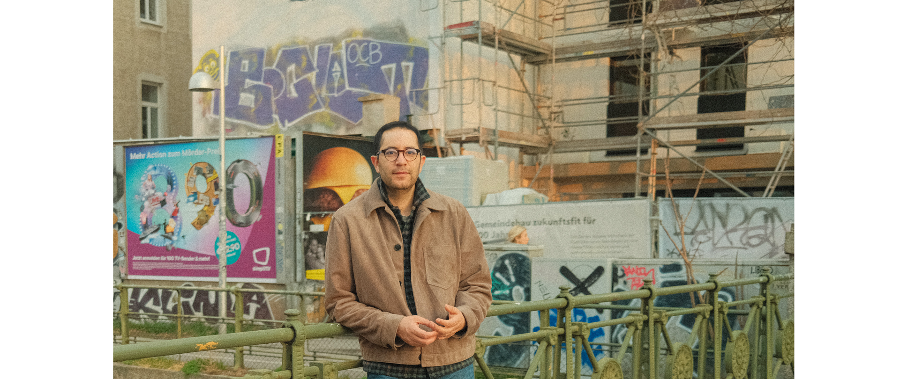

<Description>
I am Gustavo Ferregan, a Colombian artist in Austria. Used to work in museum offices and teach design. Then I moved to the Alps and shifted my career to illustration. Now my work can be found on websites, editorial, and advertising.
 
 I like stories about pointless struggles, the tragicomedy of modern life, and humans being weird together. I also run workshops and rally sketching enthusiasts in the mountains.

For commissions, collaborations, or just a chat: gustavo@ferregan.com Studio: Millennium Park 6, 6850 Lustenau, Austria [Impressum](/impressum)  [Social Media](https://www.instagram.com/__ferregan__/) © Ferregan
</Description>

<Illustrations>
        
</Illustrations>

