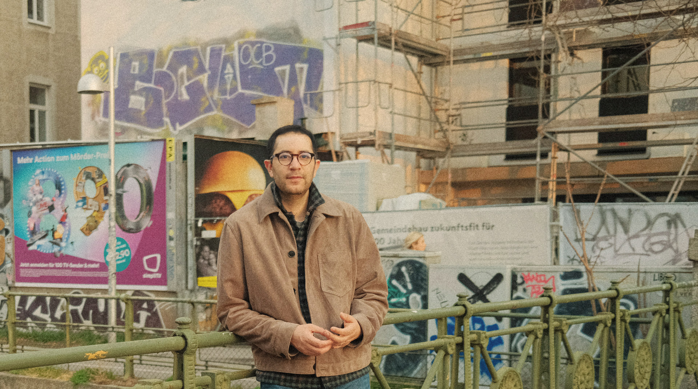

<Description>

*Info*

Oh hello there — welcome to my garden.

I'm Gustavo Ferregan, an art director and illustrator working in commercial illustration and branding.

My work shows up in editorial publications, ad campaigns, and digital platforms.

I’m based in Austria, where I run my independent studio and collaborate with teams and brands 

from here and there who see visual storytelling as essential. 

Feel free to wander around the site and make yourself at home.

*Contact*

Email: gustavo@ferregan.com  

Social: [Instagram](https://www.instagram.com/__ferregan__/)

Location: <a href="https://www.google.com/maps/place/Millennium+Park+6,+6850+Lustenau,+Austria" target="_blank" rel="noopener noreferrer">Millennium Park 6, 6850 Lustenau, Austria</a>  

Member of: <a href="https://designaustria.at" target="_blank" rel="noopener noreferrer">designaustria</a>  

*Education*

- MA in Communication and Media 

- BA in Graphic Arts 

*Awards / Promotion*

- 2024 – <a href="https://josephbinderaward.com" target="_blank" rel="noopener noreferrer">Joseph Binder Award</a>  
  Winner in Gold category in Miscellaneous Applications

*Interviews*

- 2025 – <a href="https://kreative-wirtschaft-vorarlberg.at/news/joseph-binder-award-preistraeger-gustavo-ferregan-im-gespraech" target="_blank" rel="noopener noreferrer">Kreative Wirtschaft Vorarlberg</a>  

- 2025 – <a href="https://www.vol.at/internationale-designexzellenz-in-vorarlberg/9469448" target="_blank" rel="noopener noreferrer">VOL.AT</a>  

- 2024 – <a href="https://vorarlberg.orf.at/studio/stories/3229782/" target="_blank" rel="noopener noreferrer">ÖRF</a>

[Impressum](/impressum) 

© Ferregan  

Programming by [Leo Katzengruber](https://thekatze.com)
</Description>
<Illustrations>
        
   
</Illustrations>

