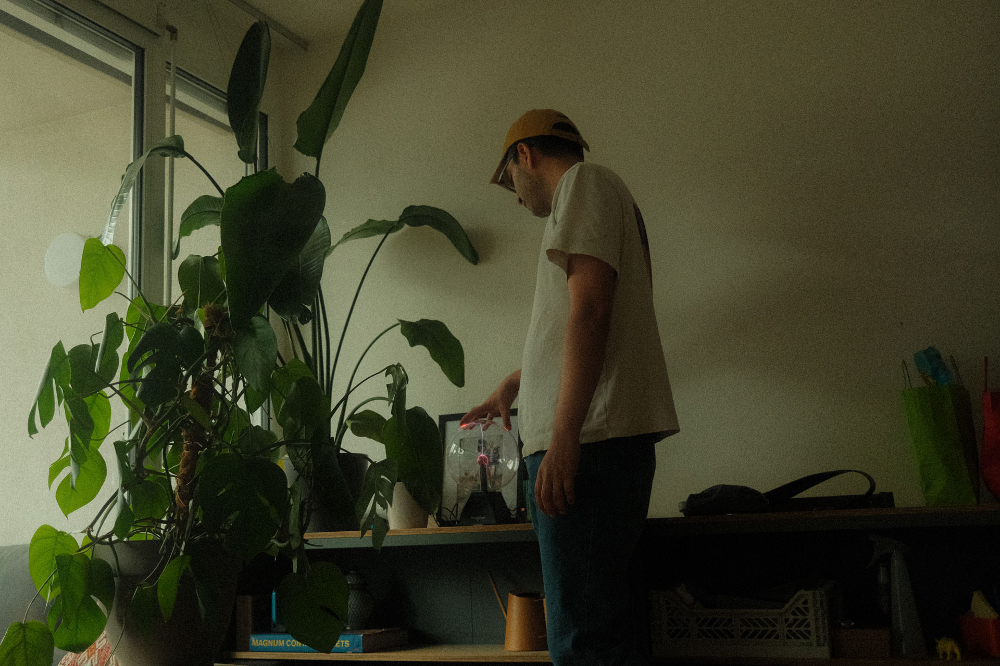

<Description>
[Ferregan](/.)

__I'm Gustavo Ferregan,__ a Colombian artist based in Austria. I studied visual arts and media communication. After working in communication offices for museums and teaching design, I moved to the Austrian Alps and changed my career to drawing. My illustrations can be found on websites, editorial, and advertising.
My preferred subjects include stories of unnecessary struggles, the tragicomedy of modern life, and human relationships. A signature element in my work is people who seem to be hit by a revelation. but I don’t really mean it. It just happens.
Parallel to my creative work, I also teach workshops and actively bring together drawing enthusiasts in the Alpine region.
</Description>
<Description>
For commissions, collaborations, or just a chat: gustavo@ferregan.com

Studio: Millennium Park 6, 6850 Lustenau, Austria

    [Impressum](/impressum)  [Social Media](https://www.instagram.com/__ferregan__/) © Ferregan
</Description>
<Illustrations>

        
   
</Illustrations>

