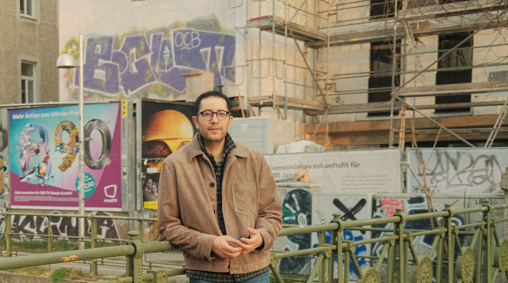

<Description>

*Info*

 

Since establishing his namesake studio in 2021, Gustavo Ferregan 

has moved between the mediums of commercial illustration, 

product design and creative direction– redefining what it means to be a graphic artist. 

Along the way he has collaborated with cultural institutions, 

brands and creative teams on editorial, advertising and digital projects.

Meanwhile his path has been marked by recognition at Austria’s prestigious

Joseph Binder Award, where he received Gold in design and illustration; 

he also takes part in talks and gatherings on creative processes,

drawing, and visual communication.

 

Member of [designaustria](https://www.designaustria.at/)

Based in Austria

 

*Inquiries*

Email: gustavo@ferregan.com  
Social: [Instagram](https://www.instagram.com/__ferregan__/)
 
Location: [Millennium Park 6, 6850 Lustenau, Austria](https://www.google.com/maps/place/Millennium+Park+6,+6850+Lustenau,+Austria)

 

*Press*

2025 – [Kreative Wirtschaft Vorarlberg](https://kreative-wirtschaft-vorarlberg.at/news/joseph-binder-award-preistraeger-gustavo-ferregan-im-gespraech)  
2025 – [VOL.AT](https://www.vol.at/internationale-designexzellenz-in-vorarlberg/9469448)  
2024 – [ORF](https://vorarlberg.orf.at/studio/stories/3229782/)
 

Programming by [Leo Katzengruber](https://thekatze.com)

[Impressum](/impressum) 

© Ferregan  

</Description>
<Illustrations>
        
   
</Illustrations>

