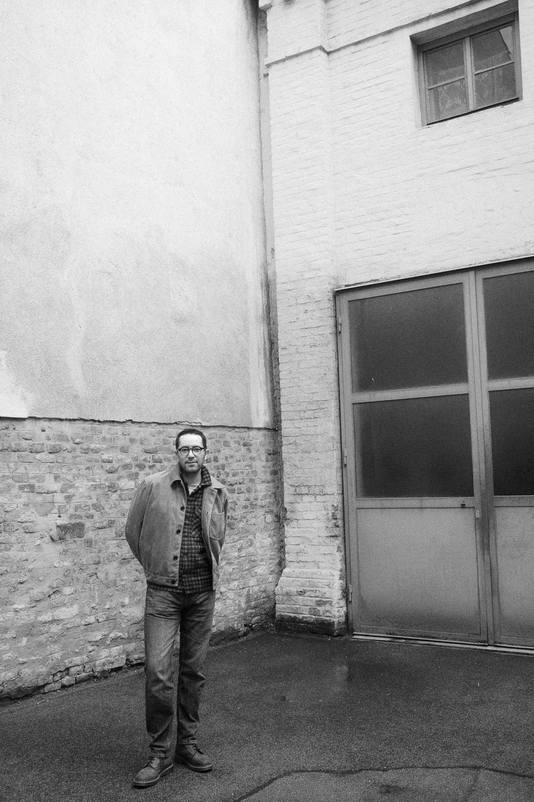

<Description>

*Info*

 
Since establishing his namesake studio in 2021, Gustavo Ferregan has moved between commercial illustration and creative direction – redefining what it means to be a graphic artist.
He has collaborated with cultural institutions, brands and creative teams on editorial, advertising and digital projects, and was awarded Gold in design and illustration at Austria’s prestigious Joseph Binder Award. He also takes part in talks on creative processes, drawing and visual communication. 
 

*Inquiries*  
Email: gustavo@ferregan.com  
Social: [Instagram](https://www.instagram.com/__ferregan__/) 

Location: Baded in Austria [Millennium Park 6, 6850 Lustenau, Austria](https://www.google.com/maps/place/Millennium+Park+6,+6850+Lustenau,+Austria) 
 
*Press* 2025 – [Kreative Wirtschaft Vorarlberg](https://kreative-wirtschaft-vorarlberg.at/news/joseph-binder-award-preistraeger-gustavo-ferregan-im-gespraech)  
2025 – [VOL.AT](https://www.vol.at/internationale-designexzellenz-in-vorarlberg/9469448) 

2024 – [ORF](https://vorarlberg.orf.at/studio/stories/3229782/)
 
Programming by [Leo Katzengruber](https://thekatze.com)

[Impressum](/impressum) 

© Ferregan  

</Description>
<Illustrations>
        
   
</Illustrations>

