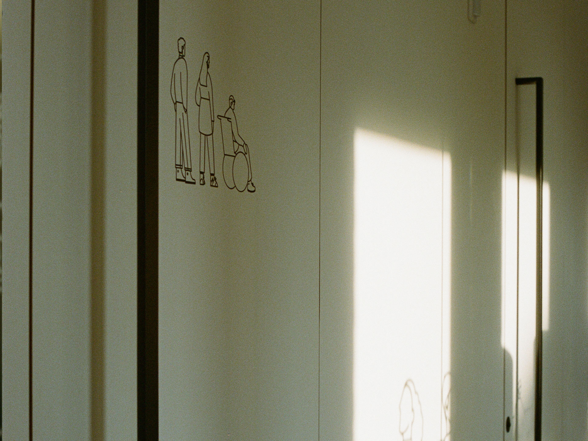

<Description>
__kpv__   “Krankenpflegevereine Klaus-Weiler-Fraxern” couldn’t be prouder of its new building. Windows, hallways, doors—now alive with drawings that show the quiet, essential connection between caregivers and the people they support. Locals, side by side, never alone. If you ever get the chance to see it, you’ll probably stand there wondering: how the hell did they pull this off?

</Description>

<Illustrations>
        
        
        
        
        
</Illustrations>

