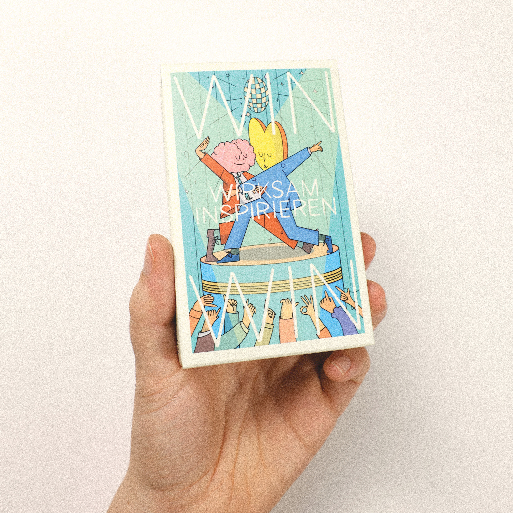

WIN is an illustrated card game designed by Gustavo Ferregan, commissioned by business consultant Vaheh Khachatouri. This game aims to become an educational tool that allows teams to inspire each other through gameplay, exploring new concepts related to teamwork. The illustrations, which depict people in everyday situations within work environments, transform this illustrated universe into more than just a game; it is an immersive experience carefully crafted to ensure that work is not taken too seriously and is not viewed as just another activity in corporate life. In fact, the design of characters in absurd and humorous situations seeks to create connections with common experiences, fostering empathy and collaboration. Each move within the game turns into a disguised lesson, inviting participants to reflect on their work dynamics and strengthen team cohesion in a fun and enjoyable way.

<Illustrations>
    

    <Slideshow>
        
        
        
    </Slideshow>
  
  

    <Grid cols={3}>
        
        
        
    </Grid>
</Illustrations>
