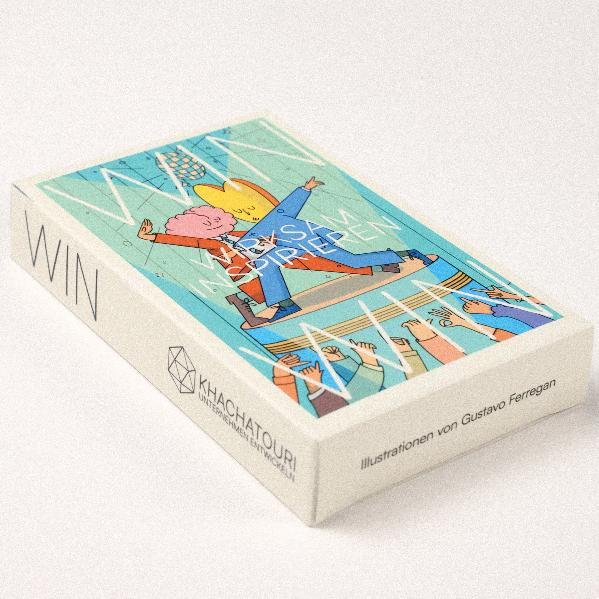
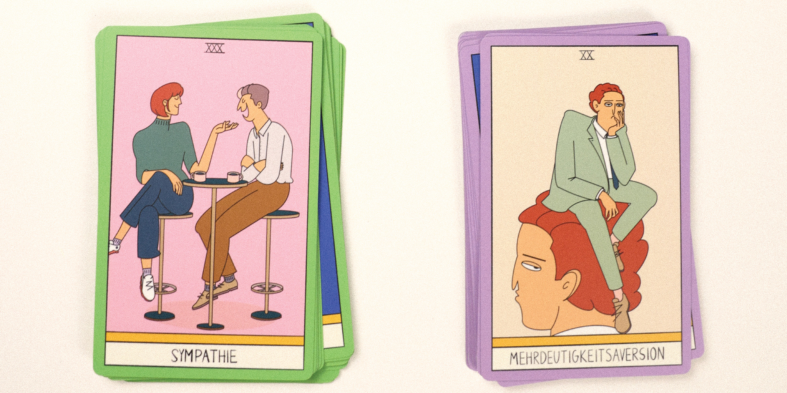
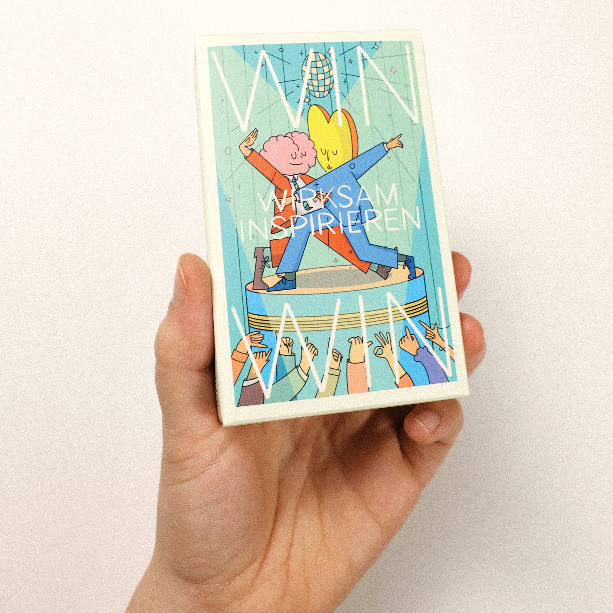
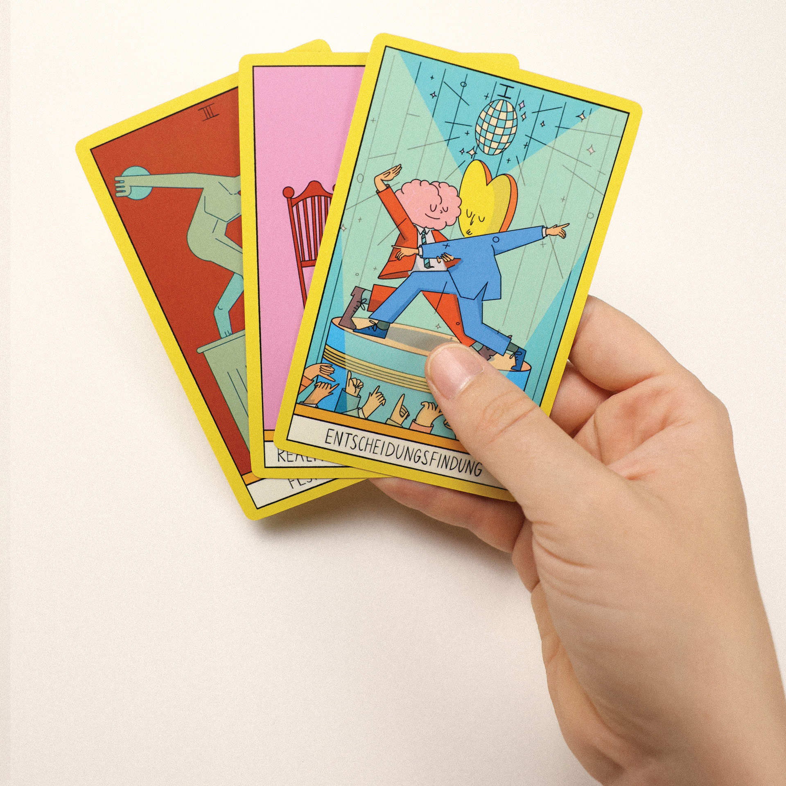

<Description>
[Ferregan](/.)

__win__ - my debut card game - here it is. I had the pleasure of illustrating and designing it for Vaheh Khachatouri. But this is no ordinary motivational deck stuffed with stock images and self-help clichés. Instead, it unfolds as an illustrated universe where ordinary characters encounter moments of revelation in the workplace. Vaheh envisioned a game that would introduce key concepts of healthy interaction and creative teamwork—not another corporate tool, but something genuinely engaging. For me, the joy was ensuring that WIN wasn’t just useful, but truly memorable. And, dare I say, it is.
</Description>

<Illustrations>
    
    
    
    
    
    
</Illustrations>
<Description>
[back to list](/.)
</Description>

